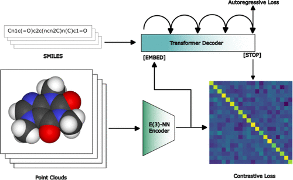

## Why discuss this paper? 

*Kaufman et al* introduce an encoder-decoder architecture with a fixed embedding size that leverages 3D structures and textual representations for encoding small molecules. For the training their model they use a combination of contrastive and generative modelling.

## Methods for molecular generations

There are a myriad of approaches for molecular generation:

- reaction-based *de novo* design -- refers to the *in silico* generation of novel chemical structures by combining reagents using structural transformations derived from known reactions [Ghiandoni2020]. This method increases the chance for a discovered the molecule to be easily accessible via known synthetic routes.

- evolutionary algorithms -- refers to genetic algorithms, differential evolution algorithms, quality-diversity algorithms, etc.

- chemical intuition -- refers human (e.g., a medicinal chemist) decision making in molecular design

- scaffold hopping -- refers to the identification of isofunctional molecular structures with chemically completely different core structures

- language modelling -- refers to generating new molecules via language models prompting (e.g. GPT-4 or Claude 3)

Besides molecular generation, there are also methods that rely on chemical universes (such as Enamine REAL). These methods rely on using preexisting databases of compounds to identify compounds for yet unknown applications.

## COATI approach to molecular design

COATI leverages two modalities: 3D points via the E3-GNN from Welling et al. [satorras2021n] and text representations via a SMILES encoder. The embeddings of the 3D points are injected to the $\mathrm{[EMBED]}$ token. The $\mathrm{[EMBED]}$ token is a special token when tokenizing the SMILES.

Since the model architecture contains a decoder, an autoregressive loss ($\Lambda_{AR}$) is added to the contrastive loss InfoNCE ($\Lambda_{\mathrm{InfoNCE}}$), resulting in:

$$
\Lambda_{\mathrm{COATI}} = \Lambda_{\mathrm{InfoNCE}} + \Lambda_{\mathrm{AR}}
$$

## Dataset

Their dataset contains 140 million structures that are tuples of the line representation and the 3D structure. Data sources:

- ChEMBL
- GEOM-Drugs
- TensorMol
- Mcule compounds
- ZINC22
- Enamine

The mixed quality of 3D geometries is purposeful to allow the model to generalize on geometries of any quality.

## Insights

> There is significant evidence that the limited expressive power of the point encoder relative to the transformer head is a major limitation of the model as-developed.

## 

## References

