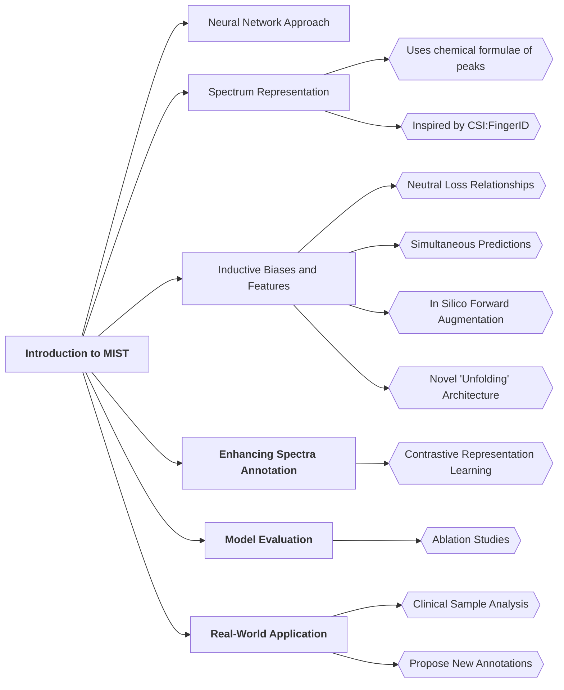

# Annotating metabolite mass spectra with domain-inspired chemical formula transformers

## Why discuss this paper?
- The article primarily focuses on metabolite analysis and small-molecule structure elucidation using deep learning approaches.
### Overview of MIST

### Summary:

- **Metabolite Analysis:**
  - Relative abundances of piperidine and pyridine alkaloids in healthy, UC, and CD patient groups are compared.
  - Total number of metabolites and novel structures identified are discussed.
  - Abundance fold changes between healthy, UC, and CD cohorts are analyzed.
  - Annotated molecule structures for select compounds are presented.

- **MIST Model:**
  - MIST accurately predicts compound fingerprints from mass spectra.
  - Contrastive fine-tuning improves metabolite retrieval.
  - The model demonstrates strong accuracy on various metabolite classes.

- **Future Directions:**
  - Need for standardized benchmarks in mass spectrometry model development.
  - Exploration of retrieval task complexities and potential biases in predictions.

## Takeaways
- Metabolite analysis compares healthy, UC, and CD patient groups, focusing on piperidine and pyridine alkaloids.
- The MIST model accurately predicts compound fingerprints from mass spectra with high accuracy.
- Future directions involve standardizing benchmarks in mass spectrometry model development and exploring retrieval task complexities and biases in predictions.

root((Research Article Mind Map))
  Introduction
    Importance of mass spectrometry in metabolomics
    Challenges in compound annotation and database retrieval
    Need for accurate methods in chemical compound identification

  Objective
    Develop and evaluate the MIST model for chemical compound annotation and database retrieval
    Enhance spectral distance calculations and network edge definitions for improved molecular networking
    Address limitations of existing methods like CSI:FingerID in chemical classification

  Methodology
    Describe MIST model architecture for embedding mass spectra into a latent space
    Explain contrastive fine-tuning workflow and spectral distance calculations
    Highlight key steps in model development and evaluation process

  Results
    Superior performance of MIST in chemical compound annotation and database retrieval
    Accuracy in clustering similar compounds and identifying biomarkers
    Comparison with existing methods like CSI:FingerID and advantages of MIST

  Discussion
    Implications of MIST's performance in organizing chemical space and guiding compound discovery
    Correlation between metabolite abundance and disease severity in UC and CD patients
    Clinical applications and potential future research directions using models like MIST

  Conclusion
    Summary of key findings and contributions of the study
    Significance of MIST in untargeted metabolomics and future applications
    Impact on advancing chemical compound identification and database retrieval methods

  Future Directions
    Potential research avenues, collaborations, and advancements in metabolomics using MIST
    Scope for further improvements in compound annotation accuracy and database retrieval efficiency
    Exploration of MIST in other areas of metabolomics and related fields for enhanced data analysis

  Q&A Session
    Address questions and discussions on methodology, results, and implications of the study
    Engage with the audience to clarify queries related to the MIST model and its applications

  References
    List of key references cited in the article for further reading and validation of the study's findings
