# Annotating metabolite mass spectra with domain-inspired chemical formula transformers

## Why discuss this paper?
- The article primarily focuses on metabolite analysis and small-molecule structure elucidation using deep learning approaches.
### Overview of MIST

```mermaid
graph TD;
    Introduction_MIST --> Neural_Network_Approach;
    Neural_Network_Approach --> Outperforms_Methods;
    Neural_Network_Approach --> No_Handcrafted_Kernels;
    Introduction_MIST --> Spectrum_Representation;
    Spectrum_Representation --> Chemical_Formulae_of_Peaks;
    Spectrum_Representation --> Inspired_by_CSI_FingerID;
    Introduction_MIST --> Inductive_Biases_and_Features;
    Inductive_Biases_and_Features --> Neutral_Loss_Relationships;
    Neutral_Loss_Relationships --> Implicitly_Featurize;
    Inductive_Biases_and_Features --> Simultaneous_Predictions;
    Simultaneous_Predictions --> Predicts_Structures;
    Inductive_Biases_and_Features --> In_Silico_Forward_Augmentation;
    In_Silico_Forward_Augmentation --> Provides_Training_Data;
    Inductive_Biases_and_Features --> Novel_Unfolding_Architecture;
    Novel_Unfolding_Architecture --> Increases_Resolution;
    Introduction_MIST --> Enhancing_Spectra_Annotation;
    Enhancing_Spectra_Annotation --> Contrastive_Representation_Learning;
    Contrastive_Representation_Learning --> Applied_on_Penultimate_Layer;
    Introduction_MIST --> Model_Evaluation;
    Model_Evaluation --> Ablation_Studies;
    Ablation_Studies --> Demonstrate_Utility;
    Ablation_Studies --> Conducted_on_Public_Dataset;
    Introduction_MIST --> Real_World_Application;
    Real_World_Application --> Clinical_Sample_Analysis;
    Clinical_Sample_Analysis --> Inflammatory_Bowel_Disease_Cohort;
    Real_World_Application --> Propose_New_Annotations;
    Propose_New_Annotations --> Dipeptide_Alkaloid_Structure;
```

### Summary:

- **Metabolite Analysis:**
  - Relative abundances of piperidine and pyridine alkaloids in healthy, UC, and CD patient groups are compared.
  - Total number of metabolites and novel structures identified are discussed.
  - Abundance fold changes between healthy, UC, and CD cohorts are analyzed.
  - Annotated molecule structures for select compounds are presented.

- **MIST Model:**
  - MIST accurately predicts compound fingerprints from mass spectra.
  - Contrastive fine-tuning improves metabolite retrieval.
  - The model demonstrates strong accuracy on various metabolite classes.

- **Future Directions:**
  - Need for standardized benchmarks in mass spectrometry model development.
  - Exploration of retrieval task complexities and potential biases in predictions.

## Takeaways
- Metabolite analysis compares healthy, UC, and CD patient groups, focusing on piperidine and pyridine alkaloids.
- The MIST model accurately predicts compound fingerprints from mass spectra with high accuracy.
- Future directions involve standardizing benchmarks in mass spectrometry model development and exploring retrieval task complexities and biases in predictions.