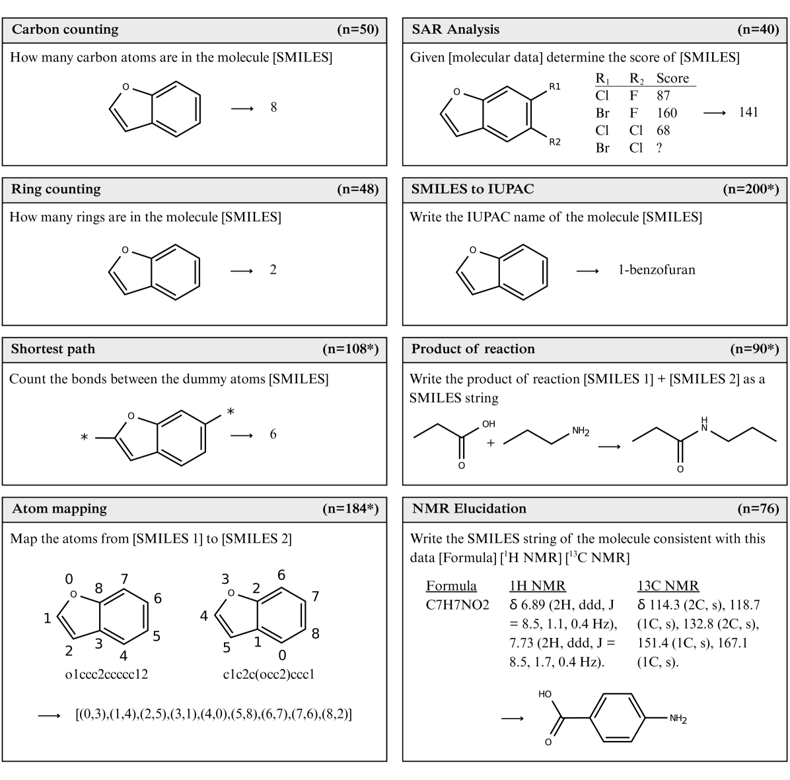
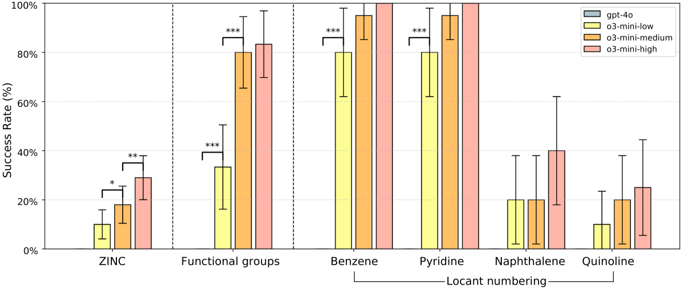

# ChemIQ: Assessing the Chemical Reasoning Abilities of Large Language Models

Authors:
- Nicholas T. Runcie (Department of Statistics, University of Oxford)
- Charlotte M. Deane (Department of Statistics, University of Oxford)
- Fergus Imrie (Department of Statistics, University of Oxford)

Date: 2025-05-12 &middot; arXiv: [2505.07735v1](https://arxiv.org/abs/2505.07735v1)

---

## Why did I choose this paper?

- Interested in the potential of LLMs to interpret and extract chemical information from scientific texts.
- Evaluating the impact of Cheminformatics MCP server (tools) on enhancing LLMs’ chemical understanding, compared to reasoning-enabled LLMs.
- Curating a set of Chemistry focused tasks that current LLMs struggle with, to inform the development of tool-augmented or agentic workflows for chemical data extraction.

## Motivation

- **Limited understanding of LLM chemical capabilities**: Previous studies showed LLMs struggle with molecular structure interpretation, restricting their use in chemistry
- **Gap in evaluation methods**: Existing chemistry benchmarks primarily use multiple-choice formats that can be solved through elimination rather than true chemical reasoning
- **Need for molecular comprehension**: LLMs that can directly interpret molecular structures would substantially advance both standalone LLMs and LLM-based systems
- **Emergence of reasoning models**: Recent development of reasoning models (o1, o3-mini, DeepSeek R1) showing substantial improvements in mathematics and science benchmarks
- **Potential for scientific discovery**: LLMs could aid in generating novel hypotheses, planning experiments, and interpreting data if they develop sufficient chemical understanding

## Terminology

- **ChemIQ**: Novel benchmark consisting of 796 questions assessing core concepts in organic chemistry, focused on molecular comprehension and chemical reasoning
- **SMILES (Simplified Molecular Input Line Entry System)**: Text-based molecular representation format used throughout the benchmark
- **Reasoning models**: LLMs explicitly trained to optimize Chain-of-Thought (CoT) reasoning across multiple domains (e.g., o3-mini, o1, DeepSeek R1)
- **Canonical vs. Randomized SMILES**: Different representations of the same molecule - canonical follows standard rules, randomized uses different atom ordering
- **IUPAC naming**: International Union of Pure and Applied Chemistry standardized naming convention for molecules
- **NMR structure elucidation**: Process of determining molecular structure from Nuclear Magnetic Resonance spectroscopy data
- **SAR (Structure-Activity Relationship)**: Analysis of how molecular structure affects biological activity or properties

## Main research questions

1. **Can reasoning models directly perform chemistry tasks?**
   - Investigation of whether LLMs can understand molecular structures without external tools

2. **What is the impact of reasoning on chemical intelligence?**
   - Comparison of reasoning models (o3-mini low/medium/high) vs. non-reasoning models (GPT-4o)

3. **Can LLMs interpret molecular representations?**
   - Assessment of ability to extract graph-based features from SMILES strings
   - Evaluation of atom counting, ring counting, shortest path determination, and atom mapping

4. **Can LLMs translate molecular structures to chemical concepts?**
   - Testing conversion of SMILES strings to IUPAC names (historically near-zero accuracy for LLMs)

5. **Do LLMs demonstrate advanced chemical reasoning?**
   - Evaluation of structure-activity relationship analysis
   - Assessment of reaction prediction capabilities
   - Testing of NMR structure elucidation from spectroscopic data

## Methods

### Benchmark Design (ChemIQ)
- **796 questions** across eight distinct categories
- **Algorithmically generated** questions allowing for reproducibility and expansion
- **Short-answer format** requiring construction rather than selection of responses
- **Three core competencies tested**:
  1. Interpreting molecular structures
  2. Translating molecular structures to chemical concepts
  3. Reasoning about molecules using chemical theory

### Question Categories
1. **Carbon counting** (n=50): Count carbon atoms in SMILES strings
2. **Ring counting** (n=48): Determine number of rings in molecules
3. **Shortest path** (n=108): Calculate bonds between dummy atoms
4. **Atom mapping** (n=184): Map atoms between different SMILES representations
5. **SMILES to IUPAC** (n=200): Generate IUPAC names from SMILES
6. **SAR Analysis** (n=40): Predict molecular scores from structure-activity data
7. **Product of reaction** (n=90): Predict reaction products as SMILES
8. **NMR Elucidation** (n=76): Generate SMILES from NMR spectroscopic data

### Models Evaluated
- **GPT-4o** (baseline non-reasoning model)
- **o3-mini-low, o3-mini-medium, o3-mini-high** (reasoning models with increasing reasoning effort)

### Evaluation Metrics
- **Success rate** across question categories
- **Reasoning token usage** to assess computational cost
- **Statistical significance testing** using McNemar tests

## Results

### Overall Performance
- **Reasoning models substantially outperformed non-reasoning models**: o3-mini achieved 28%-59% accuracy vs. GPT-4o's 7%
- **Higher reasoning levels consistently improved performance** across all tasks
- **Clear correlation between reasoning effort and success rate**

### Key Findings by Task Category

#### Molecular Structure Interpretation
- **Carbon counting**: o3-mini-high achieved 92% vs. GPT-4o's 4%
- **Ring counting**: Perfect performance (100%) for medium and high reasoning models
- **Shortest path**: 89% accuracy for canonical SMILES, 56% for randomized SMILES
- **Atom mapping**: 52% accuracy, with performance decreasing for larger molecules

#### SMILES to IUPAC Translation
- **Historic breakthrough**: First general-purpose LLM to demonstrate meaningful success
- **o3-mini-high achieved 29% accuracy** on ZINC dataset molecules
- **Functional group identification**: ~80% accuracy for common functional groups
- **Locant numbering**: High success for simple scaffolds (benzene, pyridine), lower for fused systems

#### Chemical Reasoning Tasks
- **SAR analysis**: Perfect performance (100%) for both medium and high reasoning models
- **Reaction prediction**: 56% accuracy for o3-mini-high vs. 18% for GPT-4o
- **NMR structure elucidation**: 74% accuracy for small molecules (≤10 heavy atoms)

### Impact of SMILES Representation
- **Canonical SMILES generally easier** than randomized SMILES
- **Performance drop of ~40%** for shortest path questions with randomized SMILES
- **Suggests reliance on heuristics** rather than complete molecular graph parsing

## Conclusion

### Major Achievements
- **Paradigm shift**: Latest reasoning models now possess the capability to directly solve advanced chemistry problems without external tools
- **SMILES to IUPAC breakthrough**: First general-purpose LLM to generate valid IUPAC names (29% accuracy)
- **Advanced reasoning demonstration**: Models show reasoning processes similar to human chemists, particularly in NMR structure elucidation
- **Scalable evaluation framework**: ChemIQ provides a robust benchmark for future LLM chemistry assessment

### Current Limitations
- **Performance ceiling**: Best model (o3-mini-high) achieved only 59% overall accuracy
- **Molecular size constraints**: Performance decreases significantly for larger molecules (>20 heavy atoms)
- **Reliability concerns**: Models not yet reliable enough for critical chemistry applications
- **Representation sensitivity**: Lower performance with randomized vs. canonical SMILES suggests incomplete molecular understanding

### Future Implications
- **Scientific discovery potential**: LLMs could serve as general-purpose chemical reasoning agents
- **Integration opportunities**: Combination of formal theory and heuristic insights in single inference process
- **Safety considerations**: Need for proactive addressing of potential misuse in chemical threat production
- **Research directions**: Domain-specific models and LLM-tool augmentation likely to deliver significant performance gains

### Transformational Impact
The emerging capabilities point to a new paradigm where LLMs integrate diverse information sources (patents, literature, domain knowledge) into context-aware decision-making, potentially transformational for data-limited chemical domains where conventional machine learning approaches are insufficient.

## References