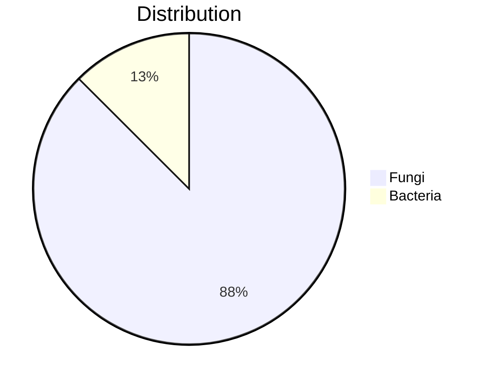

# 🧬 EMNPD Database
## *A comprehensive endophytic microorganism natural products database for prompt the discovery of new bioactive substances*

---

## Why did I choose this paper?
1. It is a natural product database that aligns with our interests and is now integrated into COCONUT 2.0.
2. The data in this database was mined from literature and using [LitSuggest](https://www.ncbi.nlm.nih.gov/research/litsuggest/) reviews and low-scoring articles were discarded (threshold <0.6), which also involved fine-tuning the model for optimal performance.
3. This is one of the newest databases that provides extensive information about molecules, including their source organisms, a key feature highly relevant to COCONUT.

## [EMNPD (Endophytic Microorganism Natural Products Database)](http://emnpd.idrblab.cn/ )
- Endophytic microorganisms, residing within plant tissues, play a vital role in biotic and abiotic stress responses by producing diverse natural products (NPs). Approximately 49.5% of FDA-approved drugs are derived from NPs or their derivatives, making endophytes a promising source for novel bioactive compounds. Despite this, existing databases lack a comprehensive focus on endophytes. The newly developed EMNPD database addresses this gap, providing open access to curated data on endophytic microorganism natural products and their bioactivities.

### 📊 Key Statistics

| 🧬 Natural Products | 🦠 Endophytes | 🎯 Biological Targets | ⚡ Bioactivities |
|:-----------------:|:-------------:|:-------------------:|:---------------:|
| **6,632** | **1,017** | **1,286** | **91** |

- **Data**: Includes physicochemical properties, ADMET information, and fermentation conditions
- **Accessibility**: Open-access, registration-free database at EMNPD website
---

## 📈 Comparative Summary of Microbial NP Databases 📉

| Database | Focus Area | Natural Products | Species | Bioactivity Data | Content Data | Quantitative Activity |
|:---------|:-----------|:---------------:|:--------:|:----------------:|:------------:|:--------------------:|
| **🌟 EMNPD** | Endophyte NPs | **6,632** | 1,017 | ✓ | ✓ | ✓ |
| MyxoDB | Myxobacterial | 674 | ✓ | ✗ | ✗ | ✗ |
| mVOC | Microbial volatiles | 2,061 | 1,034 | ✗ | ✗ | ✗ |
| NPcVar | Plant & microbial | 2,201 | 694 | ✗ | ✓ | ✗ |
| StreptomeDB | Streptomycetes | 6,524 | 3,302 | ✓ | ✗ | ✗ |
| CMNPD | Marine | 31,561 | 3,354 | ✗ | ✗ | ✓ |
| NPAtlas | Microbial | 33,372 | ✓ | ✗ | ✗ | ✗ |
| NPASS | Plant & microbial | 96,481 | 32,287 | ✗ | ✓ | ✓ |

-------------------

## Construction and Content  

### Data Extraction and Curation  
- **Sources**: Data gathered from PubMed, keyword searches, and computational tools.  
- **Filtration Process**:  
  1. Initial collection: 2600 articles.  
  2. Removal of reviews and low-scoring articles using LitSuggest (threshold <0.6).  
  3. Final curation: 1000 articles selected.  

### Data Collection and Processing  
- **Compound Characterization**:  
  - Structures sourced using PubChemPy and manually drawn using tools like ChemDraw and [KingDraw](http://kingdraw.cn/) .  
  - Classification was performed using ClassyFire and ADMET predictions with ADMETlab 2.0.  

- **Taxonomic Information**:  
  - Endophyte taxonomy derived from NCBI Taxonomy.  
  - Host plant and geographic data integrated for added context.  

- **Biological Activity Data**:  
  - Categorized into antibacterial, cytotoxic, anti-inflammatory, etc.  
  - Detailed bioactivity records linked to targets, including proteins, cell lines, and organisms.  

---

## Database Content and Statistics  

- **Chemical Diversity**:  
  - 21 chemical superclasses represented.  
  - Majority of compounds adhere to Lipinski's "Rule of Five."  

- **Taxonomic Diversity**:  

- **Bioactivity Data**:  

| 📊 Activity records | 🎯 Bioactivity Types | 🧬 Proteins | 🔬 Cell Lines | 🌍 Species |
|:------------:|:-------------------:|:----------:|:-------------:|:----------:|
| **9,457** | **86** | **94** | **282** | **910** |

---

## Utility and Discussion  

### Web Interface  
- **Search Capabilities**:  
  - Advanced search with Boolean operators for NPs, targets, and bioactivities.  
  - Structure search enabled through Ketcher molecular editor.
    

- **Browsing Features**:  
  - Visual tools like bar, tree, and sunburst charts for exploring data.  

### Downloads  
- All data is available for free download, including Docker support for local deployment.  
  - Git: https://github.com/boilism/EMNPD
  - Data: https://figshare.com/articles/dataset/EMNPD_Download_Data/24078474
---

## Conclusion  
Endophytic microorganisms are a rich source of novel secondary metabolites, known for their diverse structures and significant biological activities, particularly in antimicrobial and anticancer research. Despite the frequent discovery of new and active natural products (NPs) from these microorganisms, the integration of this data into large-scale databases is often slow, highlighting the importance of efficient information sharing for research and development. 

To address this EMNPD was developed. This database provides extensive data and interactive visualisation tools to aid in exploring the chemical diversity of these NPs. It is fully searchable and downloadable, designed to support various research perspectives. As interest in endophytic microorganisms continues to grow, EMNPD aims to become an essential resource for advancing drug discovery.
