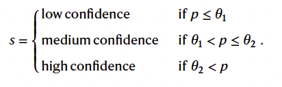

# What large language models know and what people think they know

## Why did I choose this paper?

-   interesting topic for last current topics session
-   psychological aspect of confidence: LLM vs human
-   link: [@steyvers2025large]

## Motivation

-   limited prior work (as stated by authors)
-   question of how well LLMs communicate uncertainty is unexplored
-   investigation of gap between what LLM knows and what human thinks it knows
-   essential due to increasing reliance on LLMs for decision making
-   recent studies show that LLMs may possess internal knowledge reflection, since they can distinguish…
    -   answerable and unanswerable questions
    -   truth and lies

## Terminology

-   **internal LLM confidence:** internal probability of a selected answer is compared to other possible answers, BUT is not displayed to user
-   **human confidence:** human assessment of likelihood of answer being correct (numerical probability)
    -   humans rely only on LLM language to assess confidence
    -   no info about LLM's internal confidence
-   **calibration gap:** difference between LLMs internal confidence and human perception of this confidence
-   **discrimination gap:** ability of human and LLM to distinguish (discriminate) between right or wrong answers

## Main research questions

-   **investigation of relationship between models confidence and its accuracy**
    -   is it well calibrated?
-   **Amount of calibration and discrimination gap?**
    -   Means: Is there a notable gap in assessment of output accuracy by human vs LLM?
-   **Can the gaps be reduced?**
    -   Means: can human confidence be improved by reflecting LLMs internal confidence in output?

## Methods

### Large language models

-   GPT 3.5, PaLM2, GPT 4.o
-   GPT 3.5 and PaLM2 were applied subset of Massive Multitask Language Understanding (MMLU) dataset
    -   multiple choice questions from science, technology, engineering, maths (STEM), humanities, social sciences…
-   GPT 4.o was applied to TriviaQA dataset
    -   short-answer questions
-   models confidence is computed by computing the token likelihoods for each question (numerical propability)

\

### Behavioural experiments

-   

-   steps for multiple choice:

    1.  prompt LLM with question to get internal confidence for each answer
    2.  select most likely answer
    3.  prompt LLM again to generate explanation for the chosen answer
    4.  showing the LLM-question and -answer to the user (non expert) → estimation of probability if correct
    5.  user provides his/her own answer for later experiment

-   steps for short-answer question:

    -   same as for multiple choice with one exception
    -   instead of step 2 from before LLM is prompted again to evaluate if answer is true or false

-   All experiments:

    -   

    -   Exp. 1: assesses human perception of LLMs default answer (gives information about calibration and discrimination gap)
    -   Exp. 2: Manipulation of prompts with uncertainty language (low, medium, high confidence) and length (short, mid, long)
        -   

### Metrics
- how well do human and model confidence levels correlate with correctness of answers...
- usage of ECE (expected calibration error)
    - 
    - averaging absolute differences between accuracy and confidence across M probability bins
    - **if whole term equals zero than confidence predicts accuracy perfectly**
    - N - total sample count
    - B(m) - m’th confidence bin
    - acc(B(m)) - accuracy for samples in m’th bin
    - conf(B(m)) - average confidence in m’th bin
    - 
- and AUC (area under curve)
    - 
    - assessment of diagnostic ability of confidence scores in distinguishing between correct and incorrect answers
    - **if whole term equals 1 then confidence perfectly describes if an answer is correct or wrong (perfect discrimination)**
    - **if term equals 0.5 confidence is not better than chance discrimination**
    - N(pos) and N(neg) - counts for negative and positive answers
    - C(i) and C(j) - confidence scores for i’th correct and j’th incorrect answer
    - I - equals “1” if confidence of correct answer is larger than that of incorrect answer
    - 

## Results

### Calibration and discrimination gap

-   

-   comparison of model and human confidence

-   dashed lines show calibration and discrimination gap

-   calibration error (left side)

    -   big gap between model and human calibration
    -   means accuracy is over- or underestimated by humans compared to model
    -   **standard explanations of LLM do not enable user to judge likelihood of correctness**

-   discrimination error

    -   again big gap between how well humans and models confidence can discriminate between correct or wrong answer
    -   **humans only slightly better than random guessing for baseline (default) answers**

\

### Reducing calibration and discrimination gap

-   Question: Can gaps be narrowed if low, medium and high confidence answer is displayed when LLM has low, medium or high confidence?
-   short answer: yes, see figure above!
-   long answer: application of selection rules (see Eq. 1)
    -   
    -   for this task only questions were chosen where the uncertainty language matched the inner model confidence
-   as seen in figure (red bar) calibration and discrimination gap is narrowed substantially after application of selection rule
-   **gaps are narrowed with modified explanations sensitive to models internal confidence!**
-   result: it makes sense to link uncertainty language to internal model confidence

\

### Deeper insight into calibration error: overconfidence

-   

-   graphs plot model or human confidence (x-axis) against accuracy (y-axis)

-   humans and models mostly overconfident (graph under line)

-   only GPT-4o is underconfident (graph above line)

-   humans mostly believe that LLMs are more accurate than they actually are!

\

### Explanation style and length affect human confidence

-   Question: How is human confidence affected by uncertainty expressed by LLM?

-   

-   graphs show human confidence for every explanation style...

    -   low, mid, high confidence (uncertainty language)
    -   short, mid, long answers

-   dashed line is average human confidence from baseline explanations (Exp. 1)

-   uncertainty language and length has influence on human confidence

    -   low confidence language results in lower human confidence (less trust)
    -   longer sentences result in higher human confidence (more trust)

-   answer

\

### Participants lack specialized knowledge

-   Question: Do participants have any independent (expert) knowledge?
-   for exp. 2 participants also provided their own answer
-   tests resulted that participants were not smarter than LLM (no experts present in tested groups)
-   **application of selection rule did not result in accuracy increase caused by the lack of human knowledge**
    -   meaning: you might know if an LLM is certain or uncertain about its answer, but you still have to find a better answer

\

## Potential causes of overconfidence

-   Reinforcement Learning from Human Feedback
    -   LLMs are trained on human preferences, leading to bias in explanations
    -   Users favor detailed explanations, causing models to generate overly persuasive responses
-   Autoregressive Nature of LLMs
    -   Models generate explanations that reinforce their initial answer, leading to assertive reasoning
    -   Similar to choice-supportive biases in human psychology (describes the tendency to justify past (less meaningful) purchases with rational arguments in retrospect)

 

## Conclusion

-   users overestimate LLM accuracy, especially with default explanations
-   human overconfidence poses risks in critical decision making
-   longer explanations increased user confidence, meaning users relied on explanation length rather than content to judge accuracy
-   modified answer explanations improved human accuracy perception, which highlights the need for **transparent LLM communication**

## References