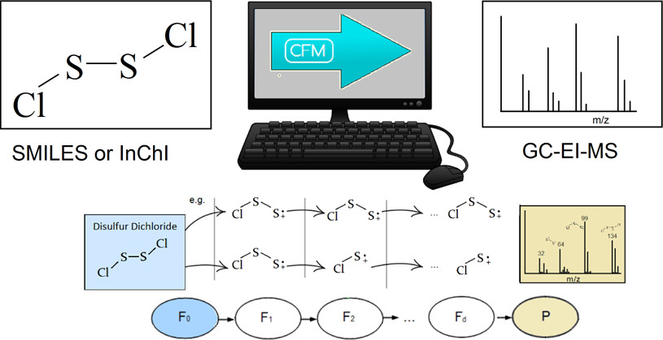
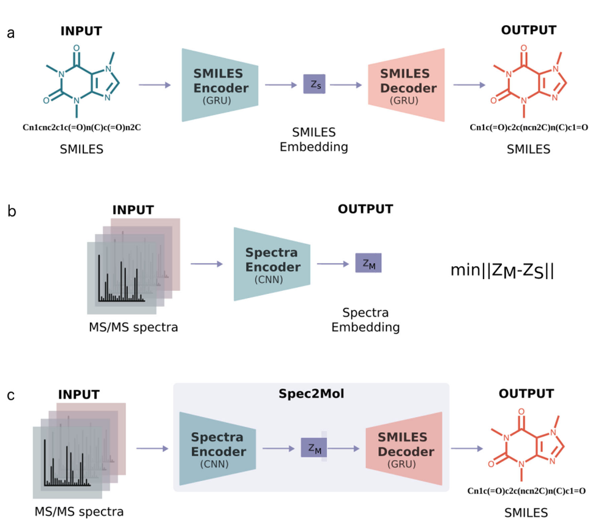
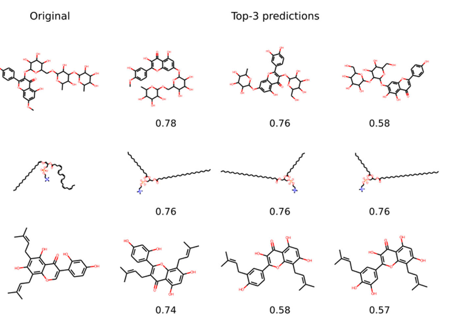

# An End-to-End Deep Learning Framework for Translating Mass Spectra to De-Novo Molecules

## Why discuss this paper? 

I chose to discuss this particular paper because of two fundamental aspects:

- Predicting experimental spectra using Machine Learning is historically a difficult and interesting task.
- Our groups are interested in this research topic.

## Context

The identification of the structure of a chemical compound is perceived as one of the most difficult tasks in experimental chemical analysis. Well known techniques for identifying unknown chemical compounds includes mass-spectroscopy (MS), nuclear magentic resonance (NMR), infrared spectroscopy (IR), gas and liquid chromatographies (GC, LC/HPLC) and many others.

## Prior work on Machine Learning for Mass Spectroscopy

### Allen et al. (2016)

The authors describe a tool called: competitive fragmentation modeling for electron ionization (CFM-EI) that given a chemical structure predicts an electron ionization mass spectrum (EI-MS). While, this method does not actually generate de-novo predictions, it is an example of a tool that can be used to augment experimental spectra databases. [@Allen2016]

### Tran et al. (2017)

The authors introduced DeepNovo, consisting ofo an end-to-end deep learning architecture for de novo peptide sequencing from mass spectra, which is a direct reconstruction of the peptide sequence from the mass spectra. [@Tran2017]

## Problem setting

This is the first approach for generating potential molecular structures from MS data that is not based on database retrieval. However, this approach also can facilitate database retrieval and additionally de-novo molecular structure recommendation using an encoder-decoder architecture.

## Approach

### Data representation

Each mass-spectrum (MS/MS) is represented as a vector in which each bit corresponds to a specific mass-over-charge (m/z) value of the recorded fragments, while the value of each bit corresponds to the intensity of the fragments. Then, the intensity values are normalized by dividing by the maximum intensity.

### Model architecture

They leverage the existence of large databases of molecular structures, by pretraining a SMILES autoencoder. The training involves translating a random SMILES into its canonical form.

### Metrics

Some metrics that have been used for quantifying the model predictions are the following:

* Fingerprint similarity through cosine similarity ($Fngp_{cosine}$)
* Maximum commom substructure (MCS) using RDKIT:
    * MCS ratio - $MCS_{ratio} = \frac{a_{MCS}}{a_{r}}$
    * MCS Tanimoto - $MCS_{tan} = \frac{a_{MCS}}{a_r + a_p - a_{MCS}}$
    * MCS overlap - $MCS_{ovrlp} = \frac{a_{MCS}}{min(a_r, a_p)}$
    * $DMF_{\%}$ - the difference between the molecular formulas of the predicted structures and the reference structure
    * $DMW_{\%}$ - the average-average difference over all the predicted structures divided by the average molecular weight of the reference structures

$a_{MCS}$ - number of atoms in the maximum common substructure

$a_r$ - number of atoms in the reference compound

$a_p$ - number of atoms in the predicted compound

### Examples

Some examples are in the Figure below, where the original molecule and the Top-3 predictions are shown. Even though there is an exact match only in 8.5% of the cases, the exact formular is predicted correctly in more than 40% of the cases. This accuracy can already be useful in a laboratory environment if the model is able to extrapolate beyond training and validation sets.

## Conclusion

Spec2Mol is based on an encoder-decoder architecture that generates molecular SMILES sequences, given mass spectra. While the proposed architecture supports the retrieval of molecules from a database that best matches the input spectra, it can also generate new molecules that have not been seen before in any dataset.