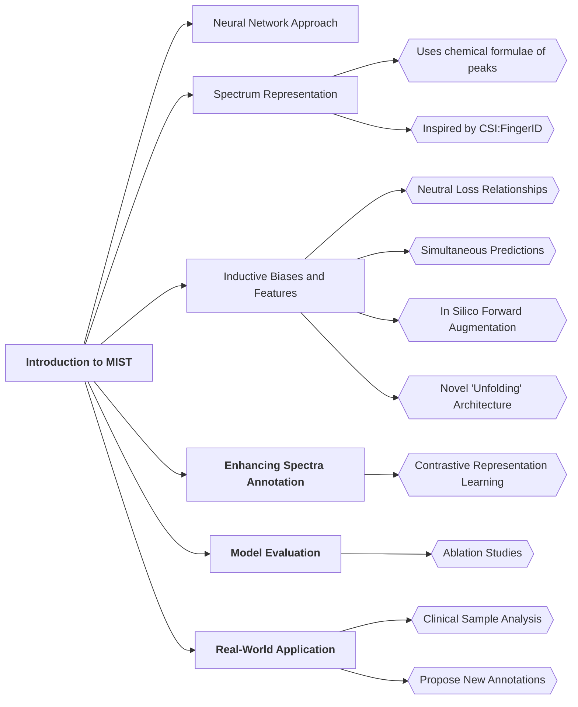
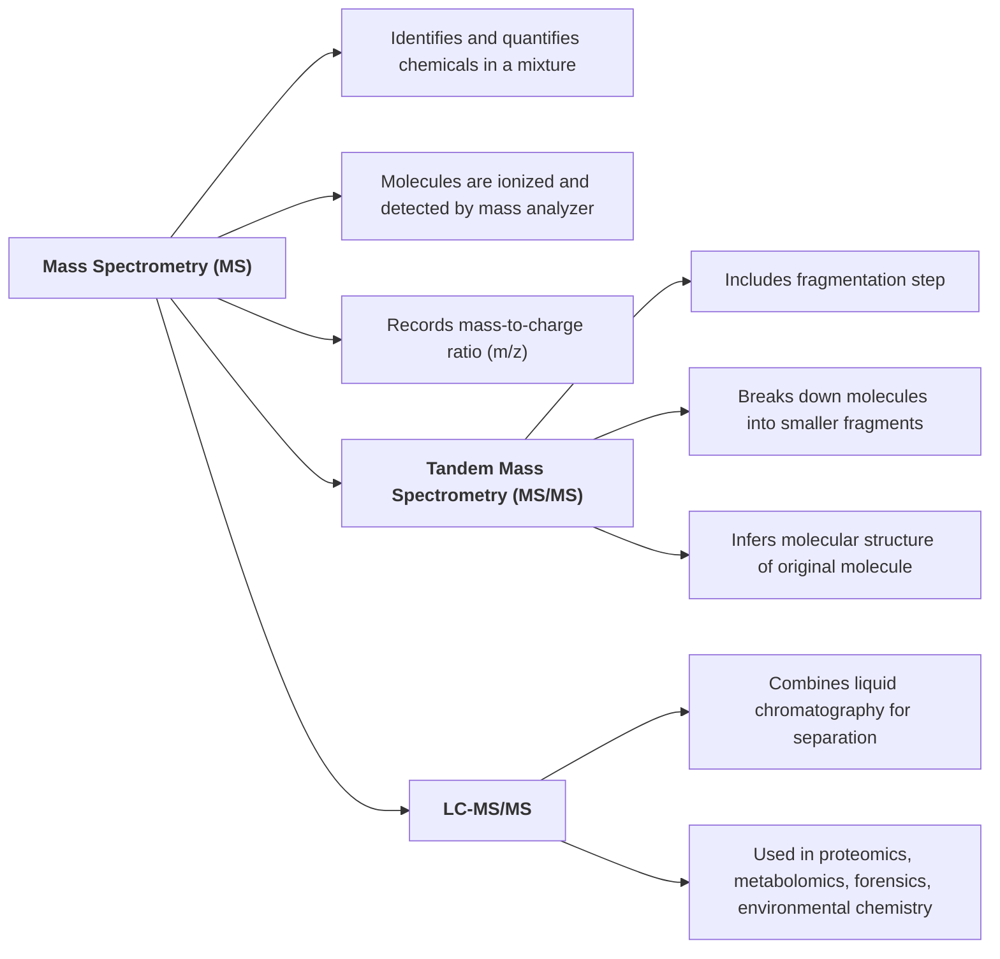
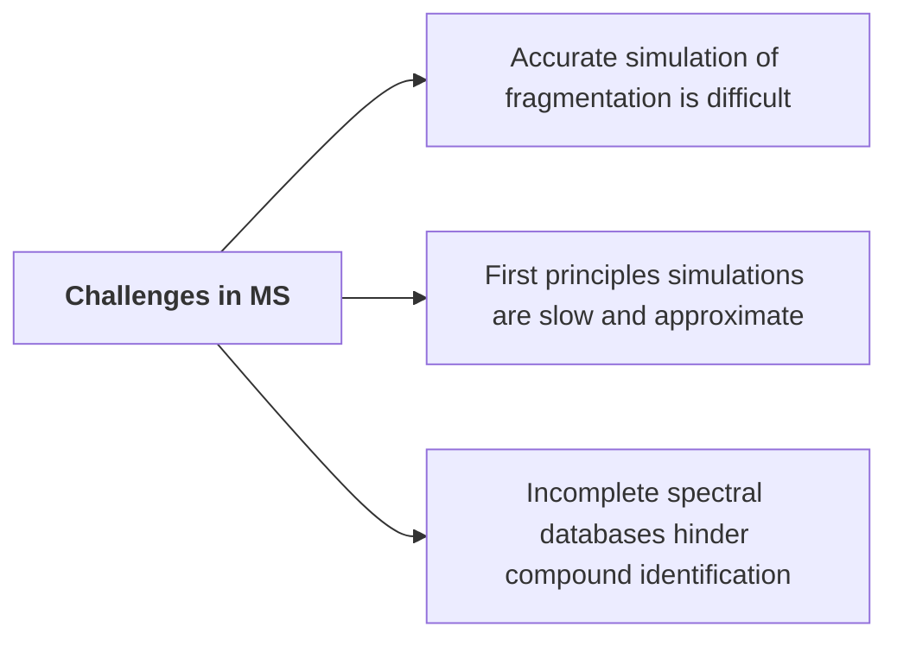
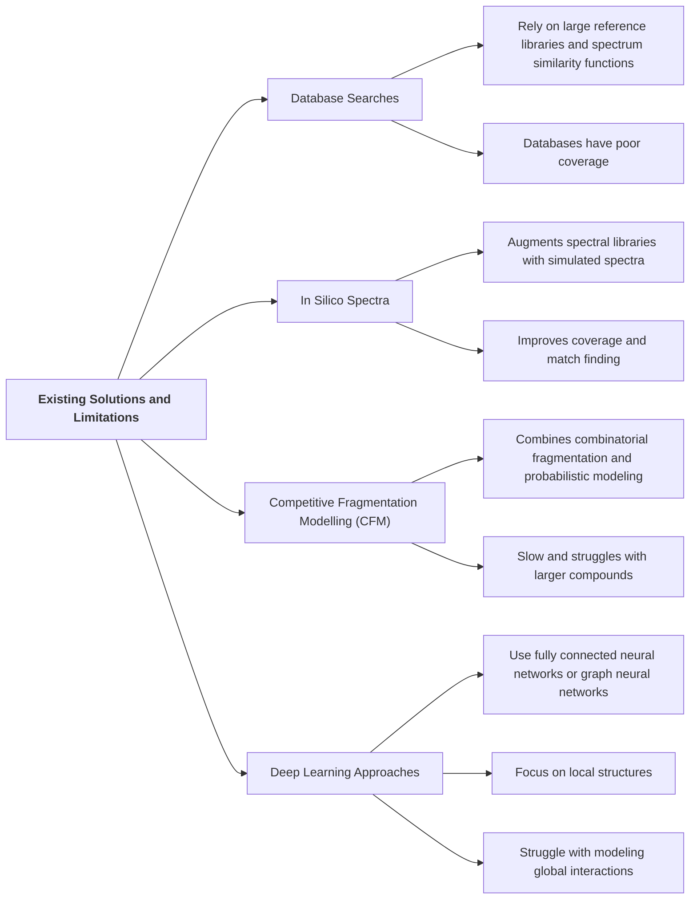
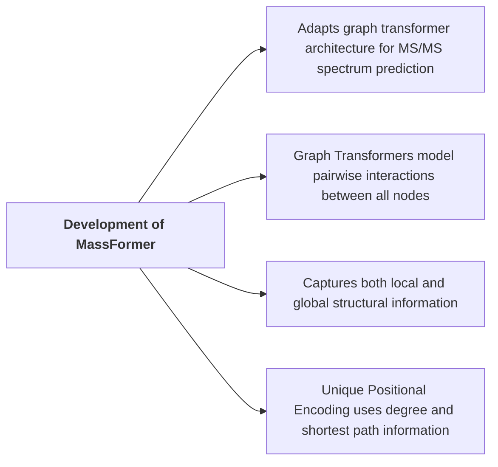
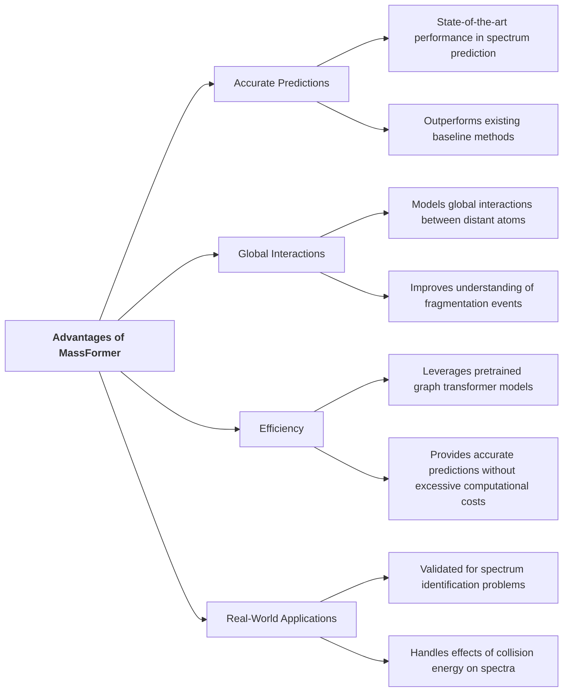

# Tandem mass spectrum prediction for small molecules using graph transformers

**Authors:** Young, A., Röst, H.

**DOI:** [doi:10.1038/s42256-024-00816-8](https://doi.org/10.1038/s42256-024-00816-8)

**Published:** April 2024

**Journal:** Nature Machine Intelligence

## Why discuss this paper?
- The article primarily focuses on metabolite analysis and small-molecule structure elucidation using deep learning approaches.
### Overview of MIST

 
Fig. 1 provides an overview of the method used in the study. It illustrates the process of extracting node and edge embeddings from the molecular graph, applying a graph transformer, extracting the chemical embedding from the readout node, adding spectral metadata, and predicting the binned spectrum. The input embeddings and graph transformer layers' parameters are initialized from a pretrained model and then fine-tuned on the spectrum prediction task. The figure visually represents the flow of information and processing steps involved in the model's operation.

 

 

 
### Summary:

### Code availability
The code used in this study is open-source (BSD-2-Clause license) and can be found in a GitHub repository (https://github.com/Roestlab/massformer/) with a DOI of https://doi.org/10.5281/zenodo.10558852.

## Takeaways
Certainly! Here are the 4 takeaway points in shorter, professional sentences:

1. **The current study introduces MassFormer, a novel method utilizing graph transformers for small molecule MS/MS spectra prediction.** 
2. **While demonstrating strong performance, MassFormer's applicability is currently limited by data type compatibility.** (limitations)
3. **The model offers explainability for its predictions; however, further development is required for detailed peak annotations.** (Need for improvement)
4. **MassFormer holds significant promise for MS-based compound identification, potentially enhancing existing tools and even aiding spectrum-to-structure generation.** (Focuses on future potential and broader applications) 
