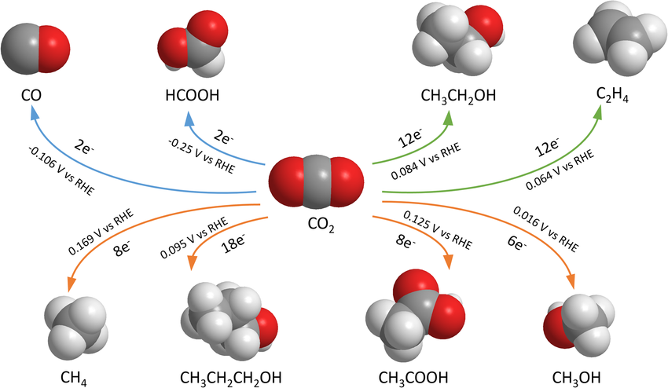
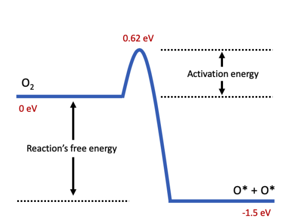
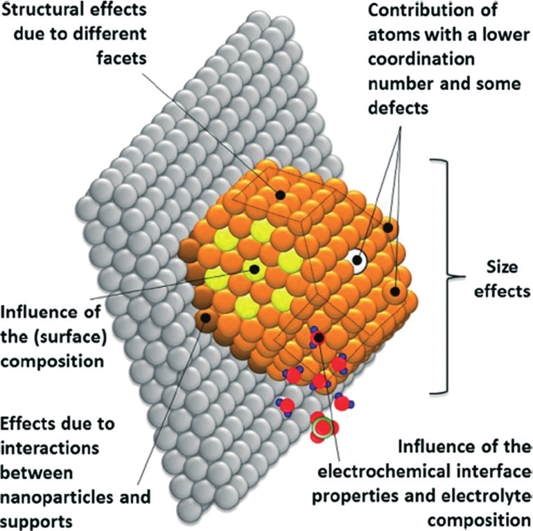
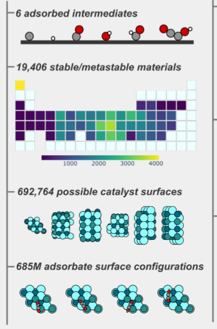
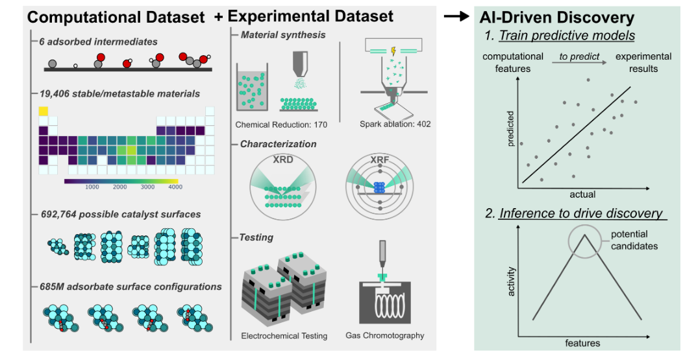
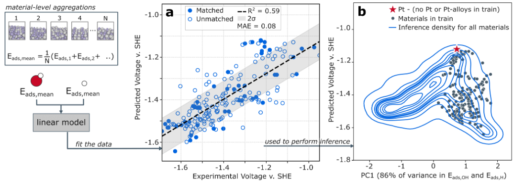
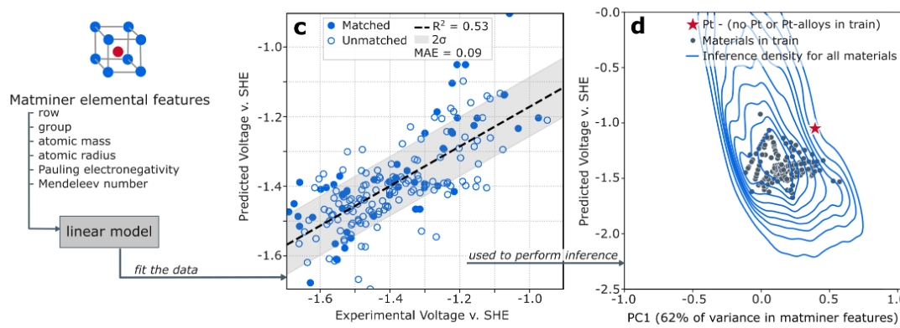
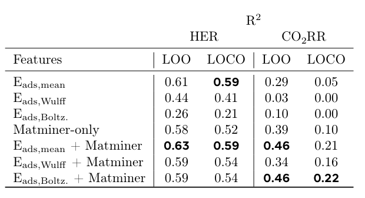

# Open Catalyst Experiments 2024 (OCx24): Bridging Experiments and Computational Models [@https://arxiv.org/abs/2411.11783]

## Motivation

- Save the world from climate change
    - Use H$_2$ instead of fossil fuels, Make H$_2$ from water electrochemically (HER).
    - Recycle CO2 into use useful products (CO2RR)

## Prior work

**Synthesizability constrained molecular generation**: Enforcing valid chemical transformations

- **Open Catalyst Project** [@https://opencatalystproject.org/]:
  - The Open Catalyst Project is a collaborative research effort between Fundamental AI Research (FAIR) at Meta and Carnegie Mellon University's (CMU) Department of Chemical Engineering. The aim is to use AI to model and discover new catalysts for use in renewable energy storage to help in addressing climate change.
  - OC20 and OC22 Datasets - These datasets altogether contain 1.3 million molecular relaxations with results from over 260 million DFT calculations.  

## How HER & CO2RR

- Catalyst can drive chemical reactions effectively.
    - Catalyst reduced the activation energy required for a reaction.
    - Molecules adsorb on catalyst surface and they assist in reactions.

## Why is this a hard problem ?

- A Combination of effects play a crucial role
    - Surface effects
    - Bulk effects
    - Structural, Defects, passivation and termination effects

- Many Intermediate short lived reactions
- Multiple adsorption site

- Cannot capture computationally
- Experimentally not feasible to explore

## Bridging Experiments and Computational Models

- Experimental Dataset with diverse systems
- Abinito features
- ML modelling

## Diverse Experimental Dataset and Extensive Computational Simulation

- Chemical reduction and spark ablation methods are used to synthesize intermetallic alloy nanoparticles.
- Deposit on silicon wafer and GDL (Gas Diffusion Layer)

- Characterize composition and phase using XRD and XRF.

- High-throughput electrochemical testing and gas detection.

###  Computational

- Intermediates - OH, CO, CHO, C, COCOH, H
- 19,406 Materials
- 685 million structural relaxations and ∼20 million DFT single points
- Ab-initio features for XRD matched experimental structures

  
## Results

### Data Driven Sabatier plot for HER

### CO2RR cannot produce volcano plot

 

## Personal opinion

- Promising Development
- Weak modeling approach

## Why did I choose this paper?

- I would like to attempt this problem from a Material Science LLM model / LLM agent setup approach
  

