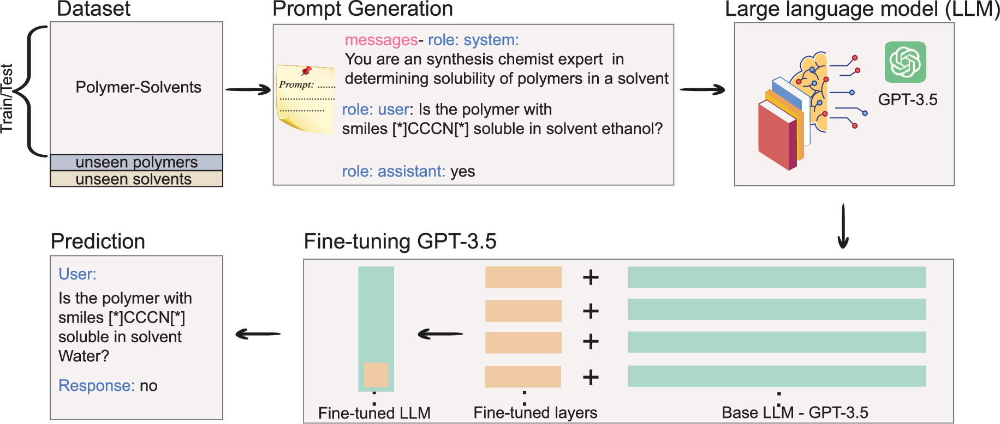
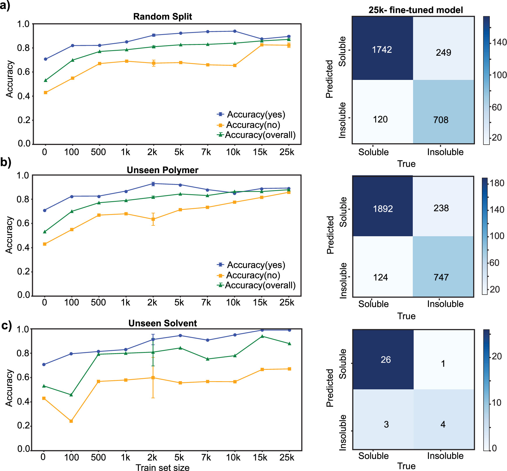
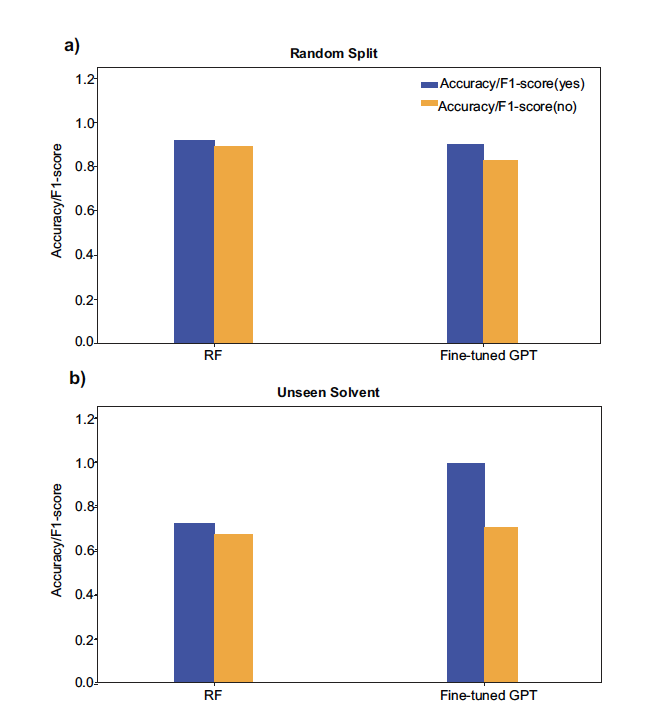

# Polymer Solubility Prediction Using Large Language Models [@Agarwal2025]

## Why did I choose this paper?

- Prediction polymer properties (e.g. solubility) has a high practical impact for many applications like drug delivery, coatings, batteries, ... .
- There are still many challenges to be overcome to reliably predict those. 

## Prior Work

**Solubility prediction using machine learning**:

- **Polymer Genome / RDKit / MACCS** fingerprints used to encode chemical structure.
- Random forests and neural networks trained on hand-engineered features.
- Kern et al. [@Kern2022]:
  - RandomForest-based classifier using generalized chemical fingerprints.
  - F1-scores: 0.92 (soluble) and 0.89 (insoluble).

## Main contributions

- First study to fine-tune a general-purpose LLM (GPT-3.5) for predicting polymer–solvent solubility.
- Uses a simple QA-format for fine-tuning, bypassing descriptor engineering.
- Achieves accuracy comparable to or better than conventional models, especially in unseen cases.

## Structure of the overall pipeline

- Curation of 30,034 polymer–solvent pairs from literature, handbooks, and databases.
- Reformulated as binary QA pairs: *"Is polymer with SMILES X soluble in solvent Y?"*
- Fine-tuning GPT-3.5 with up to 25,000 QA-pairs.
- Evaluation on seen/unseen polymers and solvents.

## Evaluation metrics

- **Accuracy (yes)**: correct prediction of soluble cases.
- **Accuracy (no)**: correct prediction of insoluble cases.
- Confusion matrices and solvent-wise breakdown used for deeper insights.

## Results

### Performance

- Best model (25k fine-tuned) achieves:
  - Accuracy (yes): 0.90
  - Accuracy (no): 0.83
- On **unseen polymers**:
  - Accuracy (yes): 0.89
  - Accuracy (no): 0.85
- On **unseen solvents**:
  - Accuracy (yes): 0.99
  - Accuracy (no): 0.69

### Comparison with prior work

- Compared accuracy (GPT-3.5) vs. F1 (Kern et al.), which is problematic due to different metrics.
- Slight overstatement of LLM performance advantage.

## Limitations

- Accuracy metric alone is insufficient in imbalanced classes (e.g., methanol: 159 vs. 2028).
- Lack of proper F1 or precision/recall evaluation limits comparability.
- Lack of additional parameters (e.g. degree of polymerization or Mw) to represent polymers

## Cost and runtime

- Fine-tuning cost: $0.0036 per row, e.g., ~$90 for 25,000 rows.
- Inference cost: $0.0005 per query.
- Runtime ~45 minutes for fine-tuning on full data.

## Conclusion

- Fine-tuned LLMs can accurately classify solubility without complex pipelines.
- Generalizes well to unseen polymer–solvent pairs.
- Makes solubility prediction more accessible to non-specialists.
- Opens possibilities for LLM-based applications in chemical informatics.

## References
