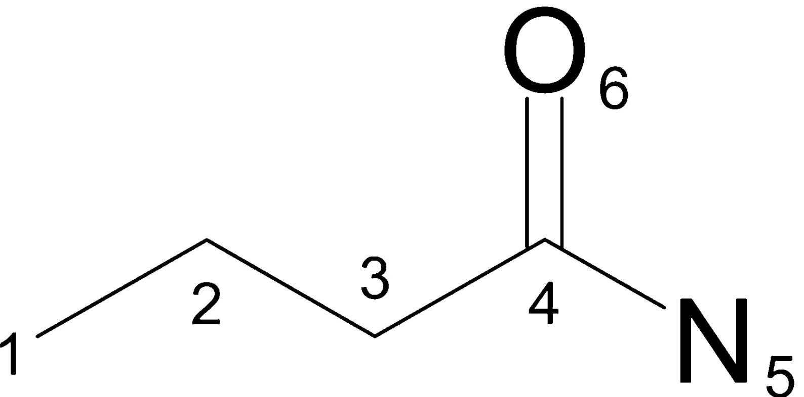
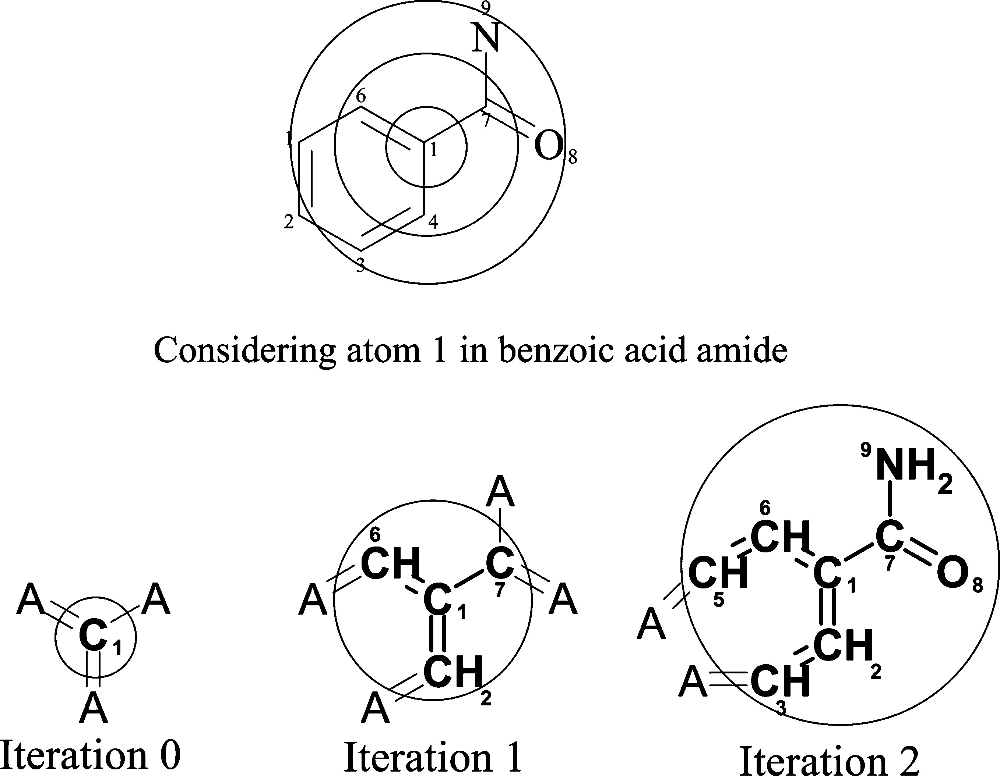
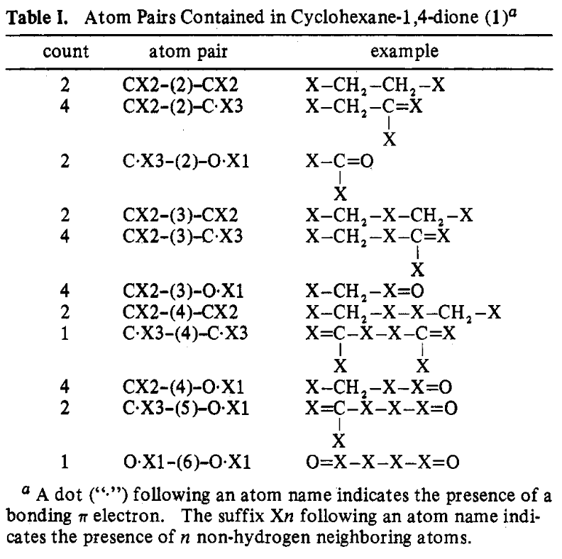
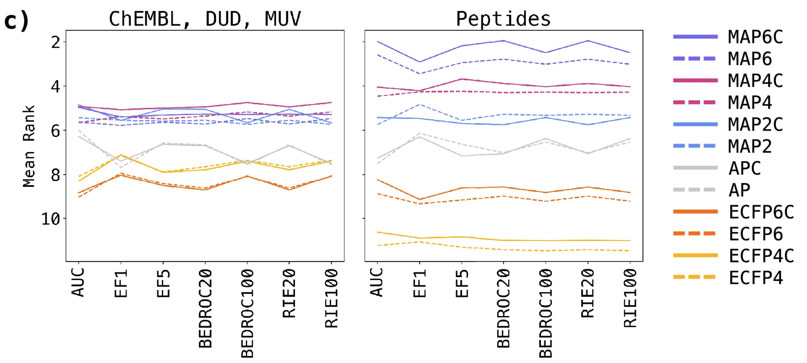
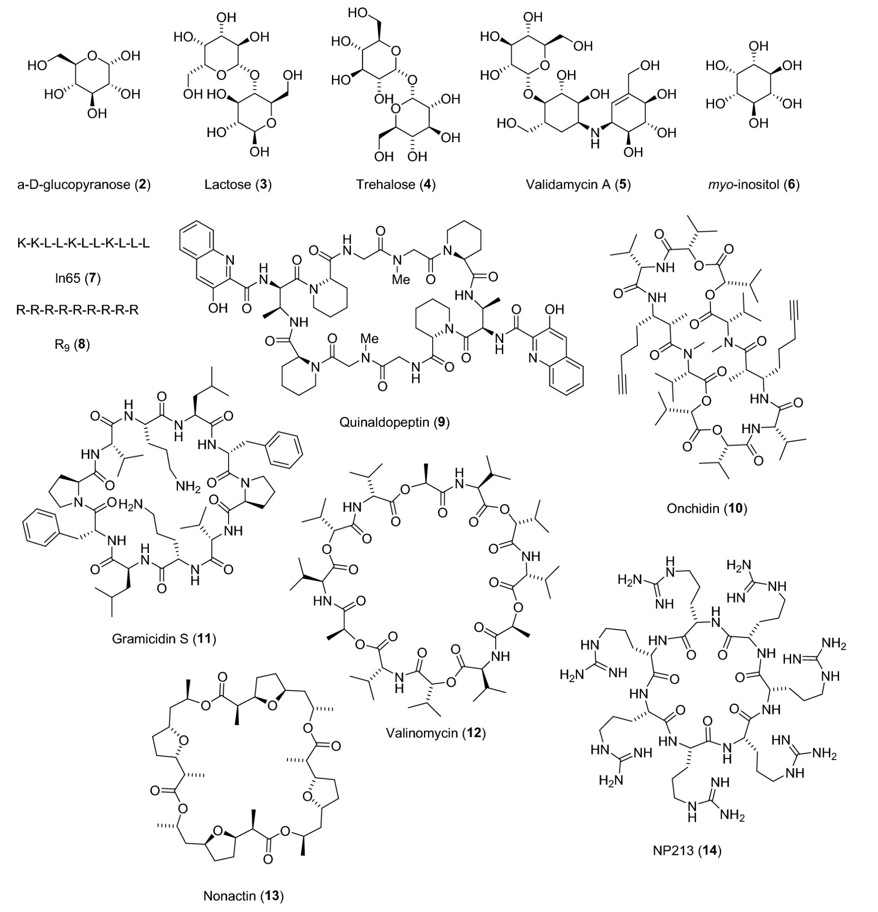

# MAP4C: One chiral fingerprint to find them all [@orsi2024one]

## Why did I choose this paper?

- one of the latest papers for molecular fingerprints
- combines two important FPs being ECFP and AP FPs
- wanted to learn something about fingerprints, because of potential importance for future machine learning tasks

## General

- **Authors**:
    - Markus Orsi → University of Bern, Biochemistry and Pharmacy
    - Jean-Louis Reymond → same as Orsi
    - both are Cheminformaticians (MAYGEN, Surge, etc)
- **Journal**: 
    - Journal of Cheminformatics, 2024
- **Notes**:
    - MAP4C = Minhashed Atom-Pair Chiral Fingerprint with diameter 4
    - builds on top of previously published MAP4 [@capecchi2020one]

## Prior work

### Extended connectivity fingerprint [@rogers2010extended]

- digital representation of a molecule's structure
- conversion of molecule's structural or chemical features into a binary or bit-string format
- historically developed for substructure and similarity searching + structure-activity modeling
- advantages: fast calculation and representation of infinite number of molecular features

#### Workflow

\

{width="300" fig-align="center"}

\

- **Step 1: Assigning an integer identifier to each atom**
    - random enumeration of atoms
    - for each atom the following properties are then quantified 
        - Number of non-hydrogen immediate neighbors (3)
        - total bond order ignoring bonds to hydrogens (4 - 0)
        - Atomic number (6)
        - Atomic mass (12)
        - Atomic charge (0)
        - Number of attached hydrogens (0)
        - is atom part of ring? (0 --> no)
    - all features are then hashed into one integer
    
    ```python
    identifier = hash((3, 4, 6, 12, 0, 0, 0))
    print(identifier)
    # -2155244659601281804
    ```

    - repeat this process for all non-hydrogen atoms

    ```python
    # Iteration 0

    1: -4080868480043360372
    2:  8311098529014133067
    3:  8311098529014133067
    4: -2155244659601281804
    5: -3602994677767288312
    6:  8573586092015465947
    ````

- Step 2: Iteratively updating the atom identifiers
    - initialization of list of tuples with iteration number and identifier (Atom 4)

    ```python
    [(1, -2155244659601281804)]
    ```

    - addition of two more numbers for each non-hydrogen neighbor
        - first: bond order
        - second: neighbours identifier
    - conversion to pure list

    ```python
    [1, -2155244659601281804, 1, -3602994677767288312, 1, 8311098529014133067, 2, 8573586092015465947]
    ```

    - list is then hashed again
        - feature now includes information about direct neighbors

    ```python
    identifier_updated = hash([1, -2155244659601281804, 1, -3602994677767288312, 1, 8311098529014133067, 2, 8573586092015465947])
    print(identifier_updated)
    # 3790237506519639747

    ...

    # Iteration 1

    1: -3879702859024654160
    2:  2648074263463118673
    3:  9209025387859845960
    4:  3790237506519639747
    5: -8399737669368778010
    6:  3271801898087186516
    ```

    - repetition of the mentioned process but with neighbors of neighbors (Iteration 2)
    - after each iteration the identifiers are added to a feature list

    ```python
    # 18 items, 6 per iteration  (0, 1 and 2)

    [-4080868480043360372, 8311098529014133067, 8311098529014133067, -2155244659601281804, -3602994677767288312, 8573586092015465947, -3879702859024654160, 2648074263463118673, 9209025387859845960, 3790237506519639747, -8399737669368778010, 3271801898087186516, 7820245418060671737, -8234949431280515543, -5902629546112570760, -3660103599533977242, -5964710996914813053, 8916398073441202914]
    ```

    {width="600" fig-align="center"}

\

- **Step 3: Deduplication**
    - removing duplicates from feature list (4 removed, 14 left)

\

- **Step 4: Conversion of identifiers to bit array**
    - initialize 1024 bit zero-array

    ```python
    import numpy as np
    fp = np.zeros(1024)     # traditionally a 1024 bit array is chosen
    print(fp)
    # array([0., 0., 0., ..., 0., 0., 0.])
    ```

    - division of each identifier by bit-array length (1024) and calculation of remainder
        - Example: `4080868480043360372 % 1024 = 908`

    ```python
    remainders = [908, 331, 244, 520, 475, 176, 849, 840, 707, 742, 84, 553, 632, 358]
    ```

    - each remainder represents the position/index in the bit zero-array at which a zero is changed to a one
    
    ```python
    for x in remainders:
    fp[x] = 1
    print(fp)
    # [0, 0, 0, 0, 0, 0, 0, 0, 0, 0, 0, 0, 0, 0, 0, 0, 0, 0, 0, 0, 0, 0, 0, 0, 0, 0, 0, 0, 0, 0, 0, 0, 0, 0, 0, 0, 0, 0, 0, 0, 0, 0, 0, 0, 0, 0, 0, 0, 0, 0, 0, 0, 0, 0, 0, 0, 0, 0, 0, 0, 0, 0, 0, 0, 0, 0, 0, 0, 0, 0, 0, 0, 0, 0, 0, 0, 0, 0, 0, 0, 0, 0, 0, 0, 1, 0, 0, 0, 0, 0, 0, 0, 0, 0, 0, 0, 0, 0, 0, 0, 0, 0, 0, 0, 0, 0, 0, 0, 0, 0, 0, 0, 0, 0, 0, 0, 0, 0, 0, 0, 0, 0, 0, 0, 0, 0, 0, 0, 0, 0, 0, 0, 0, 0, 0, 0, 0, 0, 0, 0, 0, 0, 0, 0, 0, 0, 0, 0, 0, 0, 0, 0, 0, 0, 0, 0, 0, 0, 0, 0, 0, 0, 0, 0, 0, 0, 0, 0, 0, 0, 0, 0, 0, 0, 0, 0, 1, 0, 0, 0, 0, 0, 0, 0, 0, 0, 0, 0, 0, 0, 0, 0, 0, 0, 0, 0, 0, 0, 0, 0, 0, 0, 0, 0, 0, 0, 0, 0, 0, 0, 0, 0, 0, 0, 0, 0, 0, 0, 0, 0, 0, 0, 0, 0, 0, 0, 0, 0, 0, 0, 0, 0, 0, 0, 0, 0, 0, 0, 0, 0, 0, 0, 0, 0, 1, 0, 0, 0, 0, 0, 0, 0, 0, 0, 0, 0, 0, 0, 0, 0, 0, 0, 0, 0, 0, 0, 0, 0, 0, 0, 0, 0, 0, 0, 0, 0, 0, 0, 0, 0, 0, 0, 0, 0, 0, 0, 0, 0, 0, 0, 0, 0, 0, 0, 0, 0, 0, 0, 0, 0, 0, 0, 0, 0, 0, 0, 0, 0, 0, 0, 0, 0, 0, 0, 0, 0, 0, 0, 0, 0, 0, 0, 0, 0, 0, 0, 0, 0, 0, 0, 0, 1, 0, 0, 0, 0, 0, 0, 0, 0, 0, 0, 0, 0, 0, 0, 0, 0, 0, 0, 0, 0, 0, 0, 0, 0, 0, 0, 1, 0, 0, 0, 0, 0, 0, 0, 0, 0, 0, 0, 0, 0, 0, 0, 0, 0, 0, 0, 0, 0, 0, 0, 0, 0, 0, 0, 0, 0, 0, 0, 0, 0, 0, 0, 0, 0, 0, 0, 0, 0, 0, 0, 0, 0, 0, 0, 0, 0, 0, 0, 0, 0, 0, 0, 0, 0, 0, 0, 0, 0, 0, 0, 0, 0, 0, 0, 0, 0, 0, 0, 0, 0, 0, 0, 0, 0, 0, 0, 0, 0, 0, 0, 0, 0, 0, 0, 0, 0, 0, 0, 0, 0, 0, 0, 0, 0, 0, 0, 0, 0, 0, 0, 0, 0, 0, 0, 0, 0, 0, 0, 0, 0, 0, 0, 0, 1, 0, 0, 0, 0, 0, 0, 0, 0, 0, 0, 0, 0, 0, 0, 0, 0, 0, 0, 0, 0, 0, 0, 0, 0, 0, 0, 0, 0, 0, 0, 0, 0, 0, 0, 0, 0, 0, 0, 0, 0, 0, 0, 0, 0, 1, 0, 0, 0, 0, 0, 0, 0, 0, 0, 0, 0, 0, 0, 0, 0, 0, 0, 0, 0, 0, 0, 0, 0, 0, 0, 0, 0, 0, 0, 0, 0, 0, 1, 0, 0, 0, 0, 0, 0, 0, 0, 0, 0, 0, 0, 0, 0, 0, 0, 0, 0, 0, 0, 0, 0, 0, 0, 0, 0, 0, 0, 0, 0, 0, 0, 0, 0, 0, 0, 0, 0, 0, 0, 0, 0, 0, 0, 0, 0, 0, 0, 0, 0, 0, 0, 0, 0, 0, 0, 0, 0, 0, 0, 0, 0, 0, 0, 0, 0, 0, 0, 0, 0, 0, 0, 0, 0, 0, 0, 0, 0, 1, 0, 0, 0, 0, 0, 0, 0, 0, 0, 0, 0, 0, 0, 0, 0, 0, 0, 0, 0, 0, 0, 0, 0, 0, 0, 0, 0, 0, 0, 0, 0, 0, 0, 0, 0, 0, 0, 0, 0, 0, 0, 0, 0, 0, 0, 0, 0, 0, 0, 0, 0, 0, 0, 0, 0, 0, 0, 0, 0, 0, 0, 0, 0, 0, 0, 0, 0, 0, 0, 0, 0, 0, 0, 0, 1, 0, 0, 0, 0, 0, 0, 0, 0, 0, 0, 0, 0, 0, 0, 0, 0, 0, 0, 0, 0, 0, 0, 0, 0, 0, 0, 0, 0, 0, 0, 0, 0, 0, 0, 1, 0, 0, 0, 0, 0, 0, 0, 0, 0, 0, 0, 0, 0, 0, 0, 0, 0, 0, 0, 0, 0, 0, 0, 0, 0, 0, 0, 0, 0, 0, 0, 0, 0, 0, 0, 0, 0, 0, 0, 0, 0, 0, 0, 0, 0, 0, 0, 0, 0, 0, 0, 0, 0, 0, 0, 0, 0, 0, 0, 0, 0, 0, 0, 0, 0, 0, 0, 0, 0, 0, 0, 0, 0, 0, 0, 0, 0, 0, 0, 0, 0, 0, 0, 0, 0, 0, 0, 0, 0, 0, 0, 0, 0, 0, 0, 0, 0, 1, 0, 0, 0, 0, 0, 0, 0, 0, 1, 0, 0, 0, 0, 0, 0, 0, 0, 0, 0, 0, 0, 0, 0, 0, 0, 0, 0, 0, 0, 0, 0, 0, 0, 0, 0, 0, 0, 0, 0, 0, 0, 0, 0, 0, 0, 0, 0, 0, 0, 0, 0, 0, 0, 0, 0, 0, 0, 0, 0, 0, 0, 0, 0, 0, 0, 0, 0, 1, 0, 0, 0, 0, 0, 0, 0, 0, 0, 0, 0, 0, 0, 0, 0, 0, 0, 0, 0, 0, 0, 0, 0, 0, 0, 0, 0, 0, 0, 0, 0, 0, 0, 0, 0, 0, 0, 0, 0, 0, 0, 0, 0, 0, 0, 0, 0, 0, 0, 0, 0, 0, 0, 0, 0, 0, 0, 0, 0, 0, 0, 0, 0, 0, 0, 0, 0, 0, 0, 0, 0, 0, 0, 0, 0, 0, 0, 0, 0, 0, 0, 0, 0, 0, 0, 0, 0, 0, 0, 0, 0, 0, 0, 0, 0, 0, 0, 0, 0, 0, 0, 0, 0, 0, 0, 0, 0, 0, 0, 0, 0, 0, 0, 0, 0]
    ```

    - final bit array has been created = molecular fingerprint

\

### Atom-Pair fingerprint [@carhart1985atom]

\

- similar to ECFP but for each atom all possible atom pairs including their distance are collected as features
{width="450" fig-align="center"}


### AP vs ECFP
- AP is suitable for large molecules but does not encode molecular structure in detail
- ECFP is very detailed and suitable for small molecules but misses poor perception of global features

## Abstract

- chirality often not considered in fingerprints
- developed MAP4C (chiral version of MAP4, publ. in 2020)
- MAP → “MinHashed Atom-Pair fingerprint up to four bonds”

- **concept:**
    - “MinHashes computed from character strings containing the SMILES of all pairs of circular substructures up to a diameter of four bonds and the shortest topological distance between their central atoms.”
    - MinHash = compression technique and used for similarity estimation [@probst2018probabilistic]
    - includes Cahn-Ingold-Prelog annotation (r,s)
    - “?” is used for undefined stereocenters and double bonds

- **claim:**
    - can distinguish between stereoisomers of small drugs to large natural products and peptides


## Introduction

- **What is a FP?**
    - vectors encoding molecular structure

\

- **usage of fingerprints in general:**
    - similarity & substructure search, clustering
    - ligand-based virtual screening & target prediction

\

- **Why are there almost no chiral FPs?**
    - many small drug-like compounds are achiral (Paracetamol, Xylometazolin (Nasenspray), Amylmetakresol (Neo-Angin))
    - 

\

- **Principle of MAP4C?**
    - combination of circular substructure encoding with data compression using MinHashing
    - encodes all possible pairs of circular substructures up to diameter of 4 bonds
    - pairs are written as two canonical smiles separated by shortest topological distance, counted in bonds between corresponding pair of central atoms
    - includes CIP-annotation
    - seems to be combination of circular FP and Atom Pair FP
        - Atom Pair = list all possible pairs and their distance

\

- **Advantage over ECFP4 (Extended Connectivity) and AP (Atom Pair) FPs?**
    - spans wider range of compound classes like small molecules, NPs, peptides and metabolites (claim)
    - is chiral

## Methods

- **implementation in python (RDKit)**
    - extraction of circular substructures at every non-hydrogen atom up to specified radius (r=2) as SMILES
        - isomeric information (“@”, “@@”) is removed manually
        - allene and conformational chirality not considered because not supported by SMILES (
        - Radius 0 skipped (no single atom information)
    - if central atom is chiral, first atom symbol of max-radius SMILES is replaced by CIP-descriptor (e.g. “$R$”)
    - at each radius “shingles” are generated for all possible pairs of extracted substructures
        - substructure 1 | topological distance | substructure 2
        - “shingles” → subsequences of a sequence
    - Application of MinHash to obtain fixed size vector 
    - !["Chiral shingle generation concept exemplified on a selected atom pair of polymyxin B2. The generated shingle corresponds to the pair of circular substructures (blue) separated by the shortest topological distance (red) of their central atoms. Whenever the central atom of a substructure is chiral, the atom symbol in the substructure SMILES is replaced by the Cahn-Ingold-Prelog (CIP) descriptor (R, S, r, or s), or by a question mark (?) if the stereochemistry is not defined, bracketed by two “$” characters (yellow)."](universal_chiral_fp_2024_images/map4c_principle.png)

- **Benchmark**
    - MAP4C was compared with ECFP4 and 6, and Atom-Pair FP
    - Benchmark by Riniker and Landmark which was made chiral + 60 peptide sets
        - 
        - generated all possible stereoisomers, isomers and scrambled sequences with RDKit
    - usage of 2048 bit vectors

\

- **TMAP:**
    - visualization of biochemical similarity


## Results

- **Encoding stereochemistry in MAP fingerprints**
    - In simple words: map4 and map4c of the same molecule with and without stereochemistry are similar, as intended

\

- **Virtual screening benchmark**
    - AUC, EF1, BEDROC, etc are all metrics for comparing virtual screening methods whose purpose is to rank active compounds towards e.g. an enzyme
    - comparison of performance of MAP, ECFP and AP FPs and their chiral counter parts → MAP4C performed best (fig 2c)
        - 
        - explanation: combination of high local precision from ECFP and reflection of global features from Atom-Pairs FP
        - slight bump compared to non-chiral MAPs due to chirality

\

- **Finding all stereoisomers**

    - Tab1 shows ability to assign a different fingerprint value for each stereoisomer on a series of stereochemically complex molecules comprizing carbohydrates, peptides and macrocyclic natural products (molecules shown in fig3)
        - MAPC performed well on sugars and peptides
        - performance decreased for macrocyclic NPs

\

| Query                     | N / Sym.    | Total   | MAP6C  | MAP4C | MAP2C | APC  | ECFP6C | ECFP4C |
|---------------------------|-------------|---------|--------|-------|-------|------|--------|--------|
| α-D-glucopyranose (2)     | 5 /–        | 32      | 32     | 32    | 32    | 11   | 32     | 32     |
| Lactose (3)               | 10 / –      | 1,024   | 1,024  | 1,024 | 992   | 443  | 1,024  | 1,024  |
| Trehalose (4)             | 10 / C2     | 528     | 528    | 528   | 516   | 336  | 528    | 512    |
| Validamycin A (5)         | 14 / –      | 16,384  | 16,384 | 16,384| 16,384| 7,657| 16,384 | 16,384 |
| Inositol (6)              | 6 / C6v     | 9       | 9      | 9     | 9     | 1    | 1      | 1      |
| ln65 (7)                  | 11 / –      | 2,048   | 2,048  | 2,048 | 2,048 | 196  | 1,140  | 36     |
| ln65 (scrambled)          | 11 / –      | 330     | 330    | 330   | 330   | 330  | 8      | 4      |
| ln65 (dia × scrambled)    | 11 / –      | 675,840 | 675,840|675,840|675,840|90,217| 38,500 | 144    |
| R9 (8)                    | 9 / –       | 512     | 512    | 512   | 512   | 146  | 88     | 12     |
| Polymyxin B2 (1)          | 12 / –      | 4,096   | 4,096  | 4,096 | 4,096 | 2,500| 4,096  | 1,536  |
| PMB2 (scrambled)          | 9 / –       | 1,512   | 1,512  | 1,512 | 1,512 | 1,512| 861    | 75     |
| PMB2 (dia × scrambled)    | 9 / –       | 774,144 | 774,144|774,144|774,144|287,631|602,003| 9,312  |
| PMB2 (R, S or undefined)  | 12 / –      | 531,441 | 531,441|531,441|531,441|277,901|531,441|137,781 |
| Quinaldopeptin (9)        | 8 / C2      | 136     | 136 g) | 136   | 134   | 64   | 132    | 90     |
| Onchidin (10)             | 12 / C2     | 2,080   | 2,080  | 2,080 | 2,064 | 469  | 1,760  | 810    |
| **Gramicidin S (11)**         | 10 / C2     | 528     | 528    | 504   | 334   | 25   | 448    | 243    |
| **Valinomycin (12)**          | 12 / C3     | 1,376   | 1,250  | 714   | 416   | 112  | 616    | 27     |
| **Nonactin (13)**             | 16 / C4     | 16,456  | 16,425 |16,176 |10,045 |13,189|6,474   | 675    |
| **NP213 (14)**             | 7 / C7      | 20      | 7      | 13    | 17    | 13   | 5      | 3      |

\

- {width="600" fig-align="center"}

\

- **Ranking stereoisomers versus isomers**
    - Fig4 shows that MAP4C works well in differentiating stereo and structural isomers
        - this is indicated by the much higher jaccard distance (similarity measure) for the MAP FPs, which shows that though there are only small changes in chirality and structure, the FP is still sensitive to their difference
        - 


## Conclusion 

- chiral version of MAP performs as good as achiral versions
- perform better in distinguishing stereoisomers than chiral ECFP and AP


## What I liked/didn't like about the paper

- didnt like:
    - hard to read
    - TMAP not explained (supposed to mean Tree MAP)
    - “scrambled sequences” not explained
- repetition of how FP works in methods and beginning of results
        - in supporting info S4 figure “c” is missing
- like:
    - they made quite an effort to test their new FP


## References
