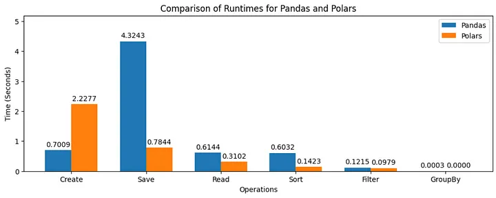

## An alternative to pandas

The advantages of polars can be directly seen in the image above. It is clear from the graph that Polars perform faster than Pandas for most operations. This is particularly true for the GroupBy operation, where Polars is nearly 20 times faster than Pandas. The Filter operation is also significantly faster in Polars, while Create operations are somewhat faster in Pandas. Overall, Polars seems to be a more performant library for data manipulation, particularly for large datasets.
